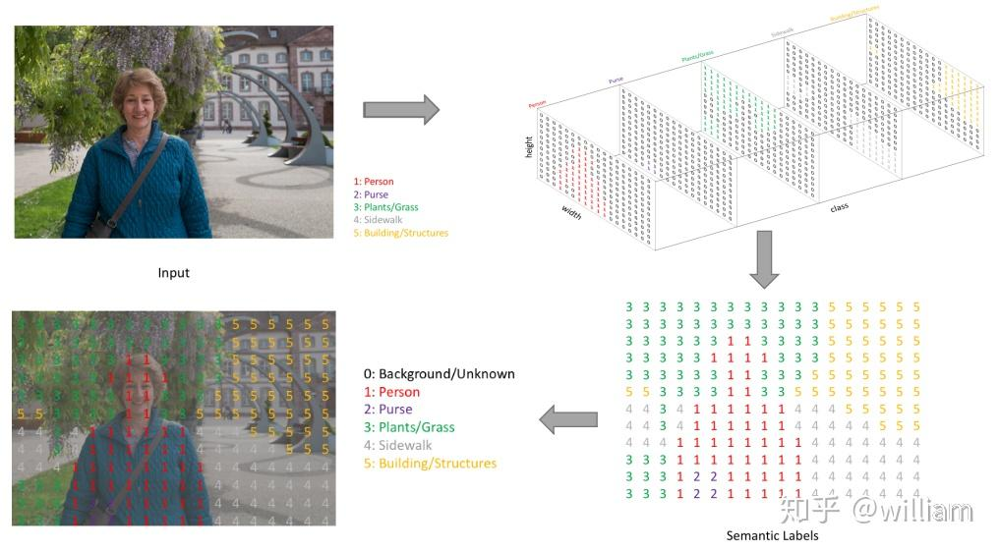

<!--
 * @Author: rooterShip
 * @Date: 2023-09-17 15:24:52
 * @LastEditors: rooterShip
 * @LastEditTime: 2023-09-17 16:10:47
-->
# 语义分割
## 图像分割的概念
- 图像分割分类是对图像中属于特定类别的像素进行分类的过程，因此图像分割可以认为是按像素进行分类的问题。
- 传统图像分割算法均是基于灰度值的不连续性和相似的性质。而基于深度学习的图像分割技术则是利用卷积神经网络，来理解图像中每个像素所代表的真实世界物体。
- 基于深度学习的图像分割技术（语义分割）主要分为：标准语义分割和实例感知语义分割。
## 语义分割的概念
- 语义分割是一种典型的计算机视觉问题，其涉及将一些原始数据作为输入并将它们转换为具有突出显示的感兴趣区域的掩膜（Mask）。
- 与其他基于图像的任务相比：
  - 图像分类：识别图像中存在的内容-- 识别图像是什么
  - 物体识别和检测：识别图像中的内容和位置（通过边界框）-- 识别图像中的位置
  - 语义分割：识别图像中存在的内容以及位置（通过查找属于它的所有像素）-- 理解图像的意义
## 语义分割的应用
- 地质检测--土地使用
- 自动驾驶
- 面部分割
- 精准农业
## 智能图像分割的任务描述
- 图像分割技术的目标是输出一个<b>RGB图像或单通道灰度图像的分割映射，其中每个像素包含一个整数类标签</b>
- 不同于目标检测输出的是目标整体的边界框和类别，标准语义分割输出图像中每个像素的类别，而实例感知语义分割输出的是目标的Mask（掩膜）
- 首先我们对左上的输入图片进行图像分割，预测图像中的每一个像素，为每个可能的类创建一个输出通道，使用 one-hot 对类标签进行编码（右上）。通过获取每个通道的argmax，可以将多通道的预测结果压缩为单通道分割图（右下）。当我们使用单通道分割图覆盖我们观察目标的单一通道时，图像中出现特定类的区域会被高亮，我们称之为掩膜（Mask）。我们可以将掩膜覆盖在观察目标上，来检查目标中的对象（左下）。值得注意的是，为了更容易了解图像分割的过程，作者使用了一个低分辨率的预测图做效果展示，而在实际的图像分割中，预测图会被Resize到原始输入图像的尺寸。
  

