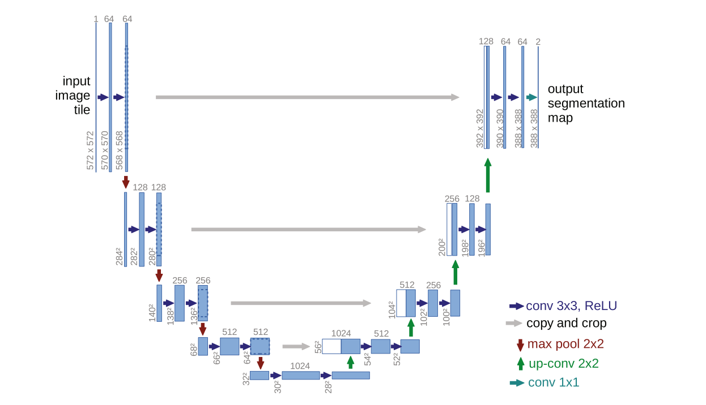
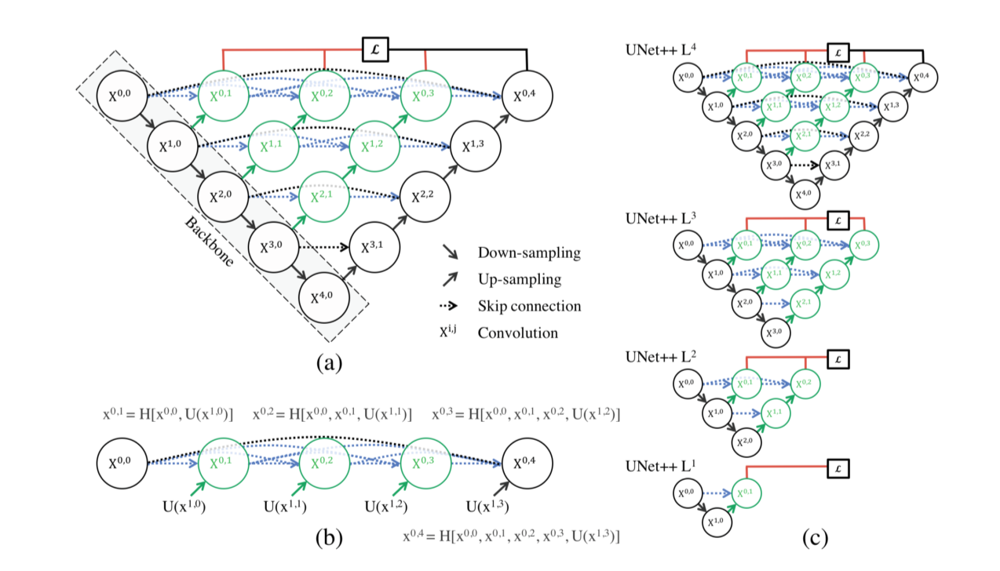

<!--
 * @Author: rooterShip
 * @Date: 2023-09-18 16:44:12
 * @LastEditors: rooterShip
 * @LastEditTime: 2023-09-20 21:45:16
-->
- Encoder-Decoder是深度学习中非常常见的一个模型框架，它并不是一个具体的模型，而是一类的框架。Encoder和Decoder部分可以是任意的文字，语音，图像，视频数据。模型可以采用CNN，RNN等。Encoder-Decoder框架有一个最显著的特征就是它是一个End-to-End学习的算法，也被叫做Sequence to Sequence learning。编码就是将输入序列转化成一个固定长度的向量，解码就是将之前生成的固定向量再转化成输出序列。
- CNN各层的作用：
  - 输入层：用于数据的输入
  - 卷积层：利用卷积核进行特征提取和特征映射
  - 激励函数（RELU）：增加非线性映射（因为卷积是线性运算）使其不仅仅能处理简单的二分类问题
  - 池化层：进行下采样，对特征图稀疏处理，减少数据运算量（压缩数据和参数的数量，减少过拟合）
  - 全连接层：输出层，用于输出卷积计算后的结果
- 多尺度特征=多尺度+特征
  在神经网络中，多尺度具体表现为将不同卷积层的输出特征图缩放为统一尺寸，使其既包含全局整体信息，又包含局部细节信息。不同尺度的图像适用于不同的任务，若图像任务简单，用小尺度图像可满足，若图像任务较难，依赖大尺度图像才能获取良好效果。 特征就是图像内某一对象与其他对象区别的信息
- Unet网络结构：先对图片进行卷积和池化（下采样），然后再对特征图进行上采样或者反卷积，蓝/白色框表示feature map，蓝色箭头表示3*3卷积，用于特征提取，红色箭头表示池化pooling，用于降维，灰色箭头是skip-connection用于特征融合，绿色箭头表示上采样upsample，用于恢复维度，青色箭头表示1\*1卷积，用于输出结果。copy and crop，其中copy就是拼接，crop就是为了让两者长宽一致。
  
- 网络层越深得到的特征图视野更大，浅层卷积关注纹理特征，深层网络关注本质特征，通过反卷积得到的更大尺寸的特征图的边缘缺少信息（每一次下采样得到特征图的同时，会损失边缘特征）失去的特征不能通过上采样找回，因此通过特征的拼接来实现边缘特征的找回。
- U-net应用医疗影像的优势
  - 医疗影像简单固定（相比于自动驾驶这类复杂的应用场景），且医疗影像的所有特征都很重要，因此低级特征和高级语义特征都很重要，所以U型结构的skip connection结构（特征拼接）更好派上用场。
  - 医学影像的数据较少，获取难度大，数据量可能只有几百甚至不到100，因此如果使用大型的网络例如DeepLabv3+等模型，很容易过拟合。大型网络的优点是更强的图像表述能力，而较为简单、数量少的医学影像并没有那么多的内容需要表述。
  - 医学影像任务中，往往需要自己设计网络去提取不同的模态特征，因此轻量结构简单的Unet可以有更大的操作空间。
- U-Net上采样通过双线性插值法进行将图像放大。
  ***
- UNET++：用于医学图像分割的嵌套U-Net架构
- U-Net++：U-Net直接连接这种方式过于粗糙，会造成连接的两个卷积层输入拥有较大的语义差别，而这种语义差别会加大网络的学习难度，同时作者认为如果进行连接的卷积层的特征图具有相当程度的语义相似性，那么整个网络的学习难度会大大减少。同时，U-Net++具有深度监督的能力。
- 为了减少语义差别，U-Net++在U-Net的直接连接的基础之上增加了系列嵌套的密集跳跃路径连接的卷积层，并融合了下一阶段卷积的特征。
- UNet++ 由通过一系列嵌套的密集卷积块连接的编码器和解码器组成。 UNet++ 背后的主要思想是在融合之前弥合编码器和解码器的特征图之间的语义差距。 例如，（X0,0,X1,3）之间的语义差距是使用具有三个卷积层的密集卷积块来桥接的。 在图形摘要中，黑色表示原始的 U-Net，绿色和蓝色表示跳过路径上的密集卷积块，红色表示深度监督。 红色、绿色和蓝色组件区分了 UNet++ 和 U-Net。 (b) UNet++第一个跳跃路径的详细分析。 (c) 如果经过**深度监督训练，UNet++ 可以在推理时进行修剪。**
  
- 深度监督：通常而言，增加神经网络的深度可以在一定程度上提高网络的表征能力，但随着深度加深，会逐渐出现神经网络难以训练的情况（梯度消失/梯度爆炸）。为了更好的训练深度网络，我们可以尝试给神经网络的某些曾添加一些辅助的分支分类器来解决这个问题。这种辅助的分支分类器能够起到一种**判断隐藏层特征图质量好坏的作用。**, 在U-Net++中添加了深度监督（图中红色显示），（深度监督的含义就是一个多分支网络，每个分支都有其对应的loss函数，然后全局的loss由分支的损失函数加权累加而成。）以便可以修剪模型以调整模型的复杂性，从而在速度（推理时间）和性能之间取得平衡。对于精确模式，平均所有细分分支的输出。对于快速模式，从分割分支之一中选择最终的输出。
  ***
- UNET3+:用于医学图像分割的全尺寸连接UNET
- U-Net3+**1.用全尺度跳跃连接将低级细节与来自不同尺度特征图的高级语义相结合。**（UNET++没有从全尺度探索到足够的信息）**2.深度监督从全尺寸聚合特征图中学习层次表示，进一步提出了一种混合损失函数.3.并涉及了一个分类引导模块来增强器官边界并减少非器官图像中的过度分割，从而产生更准确的分割结果。**
- 不同尺度的特征图探索独特的信息。（如上文提到的网络层越深得到的特征图视野更大，浅层卷积关注纹理特征，深层网络关注本质特征。）体现在医学影像当中是低级详细特征图捕捉丰富的空间信息，突出器官的边界；而高级语义特征图体现了位置信息，定位器官所在的位置。为了充分利用多尺度特征，提出了UNet3+。为了进一步从全尺寸聚合特征图中学习分层表示，每个侧输出都与混合损失函数连接，这有助于准确分割。Unet3+还可以减少网络参数以提高计算效率。
- 为满足医学图像分割的准确性要求，如何有效减少非器官图像的误报。现有的方法通过引入**注意力机制或在推理时执行预定义的细化方法（如CRF）来解决这个问题**
- 层次表示，即Hierarchical Representation，是深度学习中经常使用的一种技术。层次表示其实就是对特征的不同层次的表示，也就是不同的抽象程度。
- Dice metrics--Dice指标，Dice是医学图像比赛中使用频率最高的度量指标，是一种集合相似度度量指标，通常用于计算两个样本的相似度，值阈为[0,1]。在医学图像中经常用于图像分割，分割的最好结果是1，最差时候结果为0。
- Ground Truth：可以理解为真值，指的是**训练集**对监督学习技术的分类的准确性。