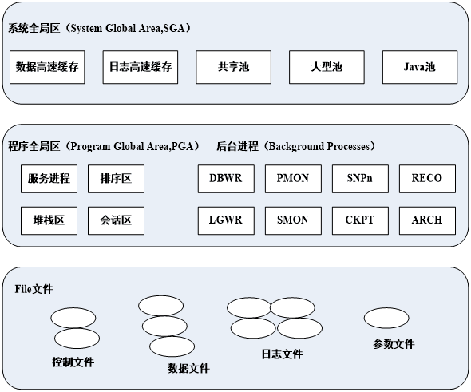
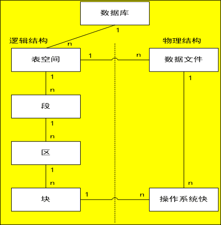
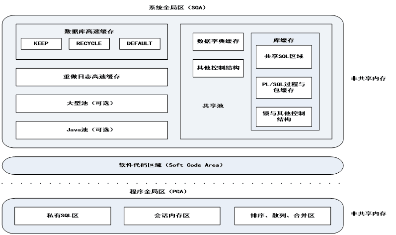

<!--
 * @Author: Rooter
 * @Date: 2021-12-20 13:27:22
 * @LastEditors: Rooter
-->
 # Oracle数据库体系结构
 
 ## 物理存储结构
 >物理存储结构是由存储在磁盘中的操作系统文件所组成的，Oracle在运行时需要使用这些文件。且三大核心文件中如果任何一个核心文件不正确，Orcle都不能正常启动（除此之外，Oracle数据库还包含一些参数文件，口令文件等） 
 
- 数据文件（*.dbf） 
 用于存储数据库数据的文件，如表中的记录，索引，数据字典信息等，数据文件又分为**永久性数据文件和临时性数据文件
- 控制文件（*.ctl） 
  是一个很小的二进制文件，用于**描述数据库的物理结构**。控制文件一般在安装Oracle系统时自动创建，并且其存放路径由服务器其参数文件SPFILEsid.ora的CONTROL_FILES参数值来确定。存储信息包括：数据库名字、创建的时间戳、数据文件的名称和位置、日志文件的名称和位置以及当前日志序列号等。
- 日志文件（*.log） 
  也叫做重做日志文件或重演日志文件。日志文件用于记录对数据库的修改信息，对数据库所作的修改信息都被记录在日志中。对数据库中的信息进行查询操作，不会产生日志信息。
 ## 逻辑存储结构
 >从逻辑的角度分析数据库的构成，即创建数据库后形成的逻辑概念之间的关系。Oracle在逻辑上将保存的数据划分为一个个小单元进行存储与管理，高一级的存储单元由一个或多个低一级的存储单元组成

 
 - 表空间 
  表空间是在Oracle中用户可以使用的最大的逻辑存储结构，用户在数据库中建立的所有内容都被存储在表空间中，所有表空间的大小的和就是数据库的大小。 
  在Oracle数据库中，存储结构管理主要就是对表空间的管理来实现的。 
  表空间根据存储数据不同，分为**系统表空间**和**非系统表空间**，系统表空间主要存放数据库的系统信息，如数据字典信息、数据库对象定义信息、数据库组件信息等。非系统表空间有撤销表空间、临时表空间、用户表空间
 - 段 
  段是由一个或多个连续或不连续的区组成的逻辑存储单元，是表空间的组成单位。按照段中储存数据的特征，可以将段分为四种类型：数据段、索引段、临时段、回滚段。
 - 区 
  数据库存储空间分配的逻辑单位，一个区由一组数据块组成，区是由段分配的，分配的第一个区称初始区，以后分配的区称增量区。一个区不能跨数据文件，即一个扩展只属于一个数据文件。一个区由一篇连续的Oracle block构成 
  每个段在定义时有许多存储参数来控制区的分配，主要是STORAGE参数，主要包括如下几项： 
   - INITIAL：分配给段的第一个区的字节数，默认为5个数据块。
   - NEXT：分配给段的下一个增量区的字节数、默认为5个数据块。
   - MAXEXTENTS：最大扩展次数。
   - PCTINCREASE：每一个增量区都在最新分配的增量区上增长，这个百分数默认为50%，建表时通常设置为0，建表空间时为1%

    区在分配时，遵循如下分配方式：
    - 初始创建时，分配INITIAL指定大小的区。
    - 空间不够时，按NEXT大小分配第二个区。
    - 再不够时，按NEXT + NEXT*PCTINCREASE分配。
 - 数据库块 
   是Oracle逻辑分配空间的最底层，又称逻辑块、页或Oracle块。一个数据块对应一个或多个物理块，块的大小由参数db_block_size确定。
 ## 内存结构
 >内存结构是Oracle数据库体系结构中最为重要的部分之一，内存也是影响数据库性能的主要因素。在Oracle数据库系统中内存结构主要分为系统全局区（SGA）和程序全局区（PGA），SGA随着数据库实例的启动向操作系统申请分配一块内存结构，随着数据库实例的关闭释放，每一个Oracle数据库实例有且只有一个SGA。PGA是Oracle服务进程启动的时候申请分配的一块内存结构。

 
 - SGA（System Global Area） 
   系统全局区是Oracle系统为实例分配的一组**共享缓冲存储区**，用于存放数据库数据和控制信息，以实现对数据库数据的管理和操作。如果多个用户连接到同一个数据库实例，则在实例的SGA中数据可为多个用户共享。在数据库实例启动时，SGA的内存被自动分配；当数据库实例关闭时，SGA被回收。 
   SGA按其作用不同，可以分为以下几个主要部分：
   - 共享池（Shared pool） 
     保存了最近执行的SQL语句、PL/SQL程序和数据字典信息，是对SQL语句和PL/SQL程序进行语法分析、编译和执行的内存区。
   - 数据缓冲区（Database Buffer Cache） 
     存储数据文件中数据块的拷贝（数据交换方式为最近最少使用算法（LRU）
   - 日志缓冲区（RedoLog Buffer Cache） 
     存储数据库的修改操作信息，恢复数据库信息。
   - Java池（可选）（Java Pool） 
     为执行java命令提供分析与执行内存空间
   - 大型池（可选）（Lager Pool） 
     用于Oracle数据库的备份与恢复操作、并行的消息缓存等。
- PGA 
  程序全局区（非共享区）是在用户连接到Oracle数据库，并创建一个会话时，由Oracle自动分配的。PGA为非共享区，只有服务进程本身才能访问它自己的PGA区，每个服务进程都有它自己的PGA区。
 ## Oracle进程结构
 - 用户进程 
   当用户连接数据库执行一个应用程序时创建的，用来完成用户所指定的任务。在oracle数据库中有两个与用户进程相关的概念：连接与会话
   - 连接是指用户进程与数据库实例之间的一条通信路径。该路径由硬件线路、网络协议和操作系统进程通信机制构成。
   - 会话是指用户到数据库的指定连接。在用户连接数据库的过程中，会话始终存在，直到用户断开连接终止应用程序为止。同一个用户可以创建多个连接来实现多个会话。
 - Oracle进程（服务器进程AND后台进程）
   - 服务器进程 
     由Oracle自身创建，用于处理连接到数据库实例的用户进程所提出的请求。
     服务器进程解析并执行用户提交的SQL语句和PL/SQL语句。
     在SGA的高速缓冲区中搜索用户进程所需要访问的数据，如果数据不在缓冲区中，则需要从硬盘数据文件中读取所需的数据，再将它们复制到缓冲区中。将查询或执行后的结果数据返回给用户进程。
   - 后台进程 
     为了保证oracle数据库在任意一个时刻都可以处理多用户的并发请求，进行复杂的数据操作，而且还要优化系统性能，oracle数据库启用了一些相互独立的附加进程，完成一类指定的工作。
     - LGWR进程 
       日志写入，进程记录有关全部提交事务所作的修改信息。
     - DBWRN进程 
       数据库写入，进程将数据库缓冲区中被修改过的数据写回到数据文件里。
     - PMON进程 
       进程监控，进程监视数据库的用户进程。若用户进程被中断，则PMON会负责清理任何遗留下的资源，释放失效的进程所保留的锁。
     - CKRT进程 
       检查点，进程负责更新数据库的最新状态。
     - SMON进程 
       系统监控，进程在实例开始时执行必要的恢复。
     - ARCN进程 
       归档，进程自动地在LGWR进程将事务日志文件填写重做项后备份这些事务日志文件。
     - RECO进程 
       恢复，进程负责在分布式数据库环境下，自动恢复失败的分布式事务。
 ## 数据字典
 >数据字典是Oracle数据库的最重要的部分之一，是由一组只读的表及其视图所组成。这些表和视图是数据库被建立同时由数据库系统建立起来的，起着系统状态的目录表的作用。Oracle中的数据字典有静态和动态之分，静态数据字典主要是在用户访问数据字典时不会发生改变的，动态数据字典反映数据库运行的一些内在信息。
