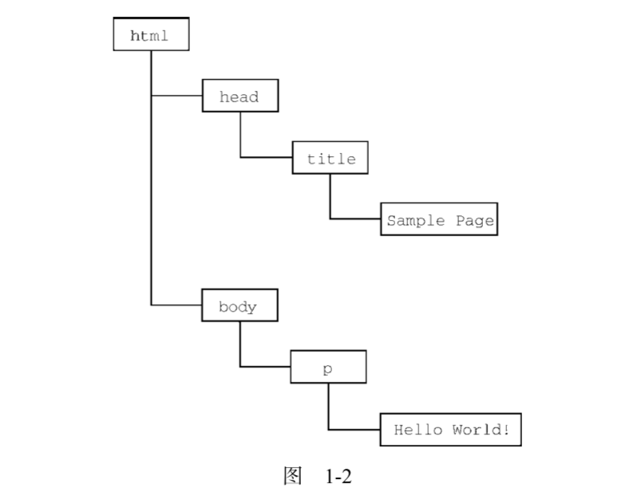

# 什么是JavaScript
## Javascript实现
***
完整的Javascript实现包含：
>核心(ECMAScript)<br>
>文档对象模型(DOM)<br>
>浏览器对象模型(BOM)<br>
- ECMAScript<br>
  - ECMAScript,即ECMA-262定义的语言，无输入和输出方法。在基本层面，ECMA-262描述这门语言的**语法**、**类型**、**语句**、**关键字**、**保留字**、**操作符**、**全局对象**。
  - ECMAScript符合性：要成为ECMAScript实现，必须满足下列条件：
    - 支持ECMA-26中描述的所有“类型、值、对象、属性、函数，以及程序语法与定义”
    - 支持Unicode字符标准<br>
    还可以满足：
    - 增加ECMA-262中未提及的“额外的类型、值、对象、属性和函数”。
    - 支持ECMA-262中没有定义的“程序和正则表达式语法”--允许修改和扩展内置的正则表达式特性。
- DOM
  - 文档对象模型（DOM，Document Object Model）是一个应用编程接口（API），用于在HTML中使用扩展的XML。DOM将整个页面抽象为一组分层节点。HTML或XML页面的每个组成部份都是一种节点，包含不同的数据。<br>
    eg:
    ```html
    <html>
      <head>
        <title>Sample Page</title>
      </head>
      <body>
        <p> Hello world!</p>
      <body>
    </html>
    ```
    
    DOM通过创建表示文档的树，让开发者可以随心所欲地控制网页地内容和结构。使用DOM API，可以轻松地删除、添加、替换、修改节点。
-BOM
  - 用于支持访问和操作浏览器的窗口，使用BOM，开发者可以操作浏览器显示页面之外的部分，总体来说BOM主要针对浏览器窗口和子窗口（frame），人们会把任何特定于浏览器的扩展归在BOM的范畴内<br>eg:
    - 弹出新浏览器窗口的能力
    - 移动、缩放和关闭浏览器窗口的功能
    - navigator对象，提供关于浏览器的详细信息
    - location对象，提供关于浏览器加载页面的详尽信息
    - screen对象，提供关于用户屏幕分辨率的消息
    - performance对象，提供浏览器内存占用、导航行为和时间统计的详尽信息（性能）
    - 对cookies的支持
    - 其他自定义对象，如 XMLHttpRequest 和 IE的 ActiveXObject<br><br>
  因为在很长时间内都没有标准，所以每个浏览器实现的都是自己的BOM，每个浏览器都会给它们定义的自己的属性和方法。现在有了HTML5，BOM的实现细节会日趋一致。
- Conclusion
  Javascript是一门用来于网页交互的脚本语言，包含以下三个组成部分
  - ECMAScript:由ECMA-262定义并提供核心功能
  - 文档对象模型(DOM):提供与网页内容交互的方法和接口
  - 浏览器对象模型(BOM):提供与浏览器交互的方法和接口