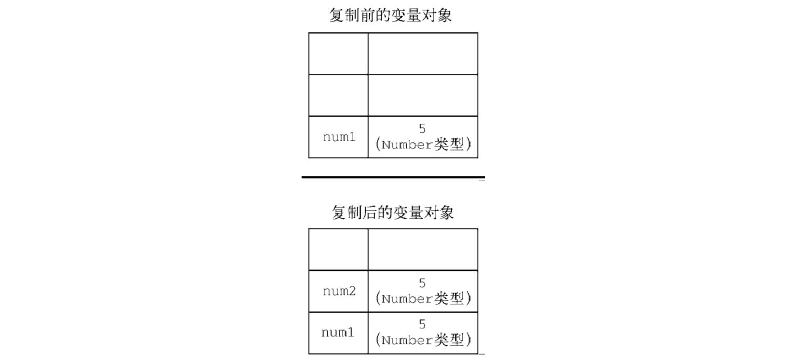
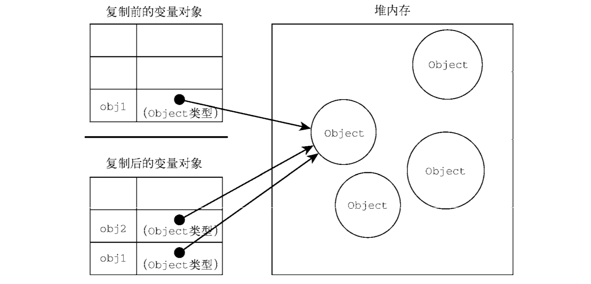

# 变量、作用域与内存
## 原始值与引用值
***
ECMAScript变量可以包含两种不同类型的数据：原始值和引用值<br>
原始值（primitive value）就是最简单的数据<br>
引用值（reference value）则是由多个值构成的对象<br>
在把一个值赋给变量时，JavaScript引擎必须确定这个值是原始值还是引用值。保存原始值的变量是按值（by value）访问的，但JavaScript不允许直接访问内存位置，因此也就不能直接操作对象所在的内存空间。在操作对象时，实际上操作的是对该对象的**引用**而非对象本身。为此，保存引用值的变量是**按引用**访问的。
- 动态属性<br>
  对于引用值而言，可以随时添加、修改和删除其属性和方法--相对应的原始值无属性
  ```js
  let person = new Object();
  person.name = 'Nicholas';
  console.log(person.name); //"Nicholas"
  ```
  原始类型初始化只可以使用原始字面量形式，如果使用的是new关键字，则javascript会创建 一个Object类型的实例，但其行为类似原始值。
  ```js
  let name1 = 'Nicholas';
  let name2 = new String('Matt');
  name1.age = 27;
  name2.age = 26;
  console.log(name1.age); //undefined
  console.log(name2.age); //26
  console.log(typeof name1); //string
  console.log(typeof name2); //object
- 复制值<br>
  除了存储方式不同，原始值和引用值在通过变量复制时也有所不同。在通过变量把一个原始值赋到另一个变量时，原始值会被复制到新变量的位置。
  ```js
  let num1 = 5;
  let num2 = num1;
  ```
  num1包含数值5，当把num2初始化为null1时，num2也会得到数值5。这个值跟存储在num1中的5是完全独立的。因为它是那个值的副本。
  
  在把引用值从一个变量赋给另一个变量时，存储在变量中的值也会被复制到新变量所在的位置。区别在于，这里复制的值实际上是一个**指针**，它指向存储在堆内存中的对象。操作完成后，两个变量实际上指向同一个对象，因此一个对象上面的变化会在另一个对象上反映出来。
  ```js
  let obj1 = new Object();
  let obj2 = obj1;
  obj1.name = "Nicholas";
  console.log(obj2.name); //"Nicholas"
  ```
  
- 传递参数<br>
  ECMAScript中所有函数的参数都是**按值传递**的
  - 原始值：值会被复制到另一个**局部变量**
  - 引用值：值在内存中的**位置**会被保存在另一个**局部变量**（即使对象是按值传进函数的，还是会通过引用访问对象，但始终不是按引用传递），对于这点个人理解为：ECMAScript中函数的参数必定为值传递，当这个参数为引用值时，将该引用值赋给另一个临时的引用值（局部变量），这两个值也同时指向同一个对象，所以一个对对象更改，另一个也会更改。但两者终究不是同一个值即非引用传递，
  ```js
  //原始值为参数
  function addTen(num){
    num += 10;
    return numl
  }

  let count = 20;
  let result = addTen(count);
  console.log(count); //20,没有变化
  console.log(result); //30


  //引用值为参数
  function setName(obj){
    obj.name = 'Nicholas';
  }

  let person = new Object();
  setName(person);
  console.log(person.name); //'Nichols'

  function setName(obj){
    obj.name = 'Nicholas';
    let obj = new Object();
    obj.name = 'Greg';
  }

  let person = new Object();
  setName(person);
  console.log(person.name); //"Nicholas"
  ```
- 确定类型<br>
  typeof操作符适合用来判断一个变量是否为原始类型，当一个变量是引用类型的时候，typeof只能返回object，并不能返回具体的object。<br>
  ECMAScript提供了instacnceof操作符，语法如下：
  ```js
  result = variable instanceof constructor;

  console.log(person instanceof Object); //变量person是Object吗？ true or false
  console.lof(colors instanceof Array); //变量colors是Array吗？ true or false
  console.lof(pattern instanceof RegExp); //变量Pattern是RegExp吗？ true or false
  ```
## 执行上下文与作用域<br>
***
变量或函数的执行上下文决定了它们可以访问哪些数据，以及它们的行为。每个上下文都有一个关联的**变量对象（variable object)**，而这个上下文中定义的所有变量和函数都存在于这个对象上。虽然无法通过代码访问变量，但后台处理数据会用到它。
- 全局上下文<br>
  全局上下文是最外层的上下文。根据ECMAScript实现的宿主环境，表示全局上下文的对象可能不一样。在浏览器中，全局上下文就是我们常说的window对象，因此通过var定义的全局变量和函数都会成为window对象的属性和方法。使用let和const的顶级声明不会定义在全局上下文中，但在作用域链解析上效果是一样的。上下文在其所有代码都执行完毕后会被销毁，包括定义在它上面的所有变量和函数。<br>
  每个函数调用都有自己的（执行）上下文。当代码执行流进入函数时，函数的上下文被推到一个上下文栈上（栈顶）。在函数执行完之后，上下文栈会弹出该函数上下文，将控制权返还给之前的执行上下文。ECMAScript程序的执行流程就是通过这个上下文栈进行控制的。<br>
  上下文中的代码在执行的时候，会创建变量对象的一个**作用域链**（scope chain），这个作用域链决定了各级上下文中的代码在访问变量和函数时的顺序。代码正在执行的上下文的变量对象始终位于作用域的最前端。如果上下文是函数，则其**活动对象（activation object）**用作变量对象。活动对象最初只有一个定义变量：arguments。（全局上下文中没有这个变量）作用域链中的下一个变量对象来自包含上下文，再下一个对象来自再下一个包含上下文。以此类推直至全局上下文；全局上下文的变量对象始终是作用域链的最后一个变量对象。<br>
  代码执行时的标识符解析是通过沿作用域链逐级搜索标识符完成的。搜索过程始终从作用域链的最前端开始，然后逐级往后，直到找到标识符
- 作用域链增强<br>
  虽然执行上下文主要有全局上下文和函数上下文两种（eval()调用内部存在第三种上下文），但有其他方式来增强作用域链。某些语句会导致在作用域链前端临时添加一个上下文，这个上下文在代码执行后会被删除。通常在两种情况下会出现这个现象，即代码执行到下面任意一种情况时：<br>
   - try/catch语句的catch块
   - with语句
  
  这两种情况下，都会在作用域链前端添加一个变量对象，对with语句来说，会向作用域链前端添加指定的对象；对catch语句而言，则会创建一个新的变量对象，这个变量对象会包含要抛出的错误对象的声明。
- 变量声明
  - 使用var的函数作用域声明<br>
    在使用var声明变量时，变量会被自动添加到最接近的上下文。在函数中，最接近的上下文就是函数的局部上下文。在with语句中，最接近的上下文也是函数上下文。如果变量未经声明就被初始化了，那么它就会自动被添加到全局上下文。
    ```js
    function add(num1, num2){
      var sum = num1 + num2;
      return sum;
    }

    let result = add(10, 20); //30
    console.log(sum); //Error


    //未声明直接初始化
    function add(num1, num2){
      var sum = num1 + num2;
      return sum;
    }

    let result = add(10, 20); //60
    console.log(sum); //30,结合chp3中提到的函数内声明变量去掉var即变全局变量。（不推荐）
    ```
  - 使用let的块级作用域声明<br>
    块级作用域由最近的一对包含花括号{}界定。let的行为非常适合在循环中中声明迭代变量，使用var声明的迭代变量会泄露到循环外部（chp3提到）
    ```js
    for(var i = 0; i < 10; i++){}
    console.log(i); //10
    

    for(let j = 0; j < 10; j++){}
    console.log(j); //j没有定义
    ```
  - 使用const的常量声明<br>
    使用const声明的变量必须同时初始化为某个值。一经声明，在其生命周期的任何时候都不能再重新赋予新值；const声明只应用到顶级原语或者对象，即，赋值为对象的const变量不能再被重新赋值为其他引用值，但对象的键则不受限制。
    ```js
    const o1 = {};
    o1 = {}; //TypeError:给常量赋值

    const o2 = {};
    o2.name = 'Jake';
    console.log(o2.name); //'Jake'
    ```
    如果想让整个对象都不能修改，可以使用Object.freeze()，当给属性赋值时，虽然不会报错，但会静默失败：
    ```js
    const o3 = Object.freeze({});
    o3.name = 'Jake';
    console.log(o3.name); //undefined
    ```
- 垃圾回收<br>
  javascript是使用垃圾回收的语言，也就是说执行环境负责在代码执行时管理内存。即通过自动内存管理实现内存分配和闲置资源回收。基本思路：确定哪个变量不会再使用，然后释放它占用的内存。并且为周期性自动运行。因此，垃圾回收程序必须跟踪记录变量是否还会使用，主要有两种方法：
    - 标记清理<br>
      当变量进入上下文，这个变量会被加上存在于上下文中的标记，在上下文中的变量，逻辑上讲，永远不应该释放它们的内存。当变量离开上下文时，也会被加上离开上下文的标记。垃圾回收程序运行的时候，会标记内存中存储的所有变量。然后去掉在上下文的变量以及被在上下文中的变量引用的变量。在此之后再被加上标记的变量就是待删除的了。（任何在上下文中的变量都访问不到它们了）<br>
      >给变量加标记的方式有很多种，比如当变量进入上下文时，反转某一位；或者可以维护“在上下文中”和“不在上下文中”两个变量列表，可以把变量从一个列表转移到另一个列表...<br>
    - 引用计数（不建议使用）
- 性能<br>
  垃圾回收程序会周期运行，当在内存有限的设备上，垃圾回收有可能会明显拖慢渲染的速度和帧速率，因此垃圾回收的时间调度很重要。,<br>
  现代垃圾回收程序会基于对javascript运行时环境的探测来决定何时运行。IE7后，javascript引擎的垃圾回收程序被调优为动态改变分配量、字面量或数组槽位等会出发垃圾回收的阈值。
- 内存管理<br>
  将内存占用量保持在一个较小的值可以让页面性能更好。优化内存占用的最佳手段就是保证在执行代码时值保存必要的数据。如果数据不必要，那么把它设置为null，从而释放其引用--**解除引用**，由于局部变量在超出作用域后会被自动解除引用，所以这个建议适合全局变量和全局对象的属性。
  ```js
  function createPerson(name){
    let localPerson = new Object();
    localPerson.name = name;
    return localPerson;
  }

  let globalPerson = createPerson("Nicholas");

  //解除globalPerson对值的引用
  gloabalPerson = null;
  ```
  解除对一个值的引用并不会自动导致相关内存会被回收。解除引用的关键在于确保相关的值已经不再上下文里了，因此它在下次垃圾回收时会被回收。
  - 通过const和let声明提升性能<br>
    const和let都以块（而非函数）作用域，相比于var，一般会早一点被回收
  - 隐藏类和删除操作
  - 内存泄漏<br>
    - 意外声明全局变量是最常见但也最容易修复的内存泄露问题
      ```js
      function setName(){
        name = 'Jake';
      }
      ```
      此时，解释器会把变量name当作window的属性来创建（window.name = 'Jake')，此种情况下，只要在变量声明前加上var、let或const即可。
    - 定时器<br>
      定时器的回调通过闭包引用了外部变量
      ```js
      let name = 'Jake';
      setInterval(()=>{
        console.log(name);
      },100); //定时器一直运行回调函数中引用的name就会一直占用内存。
      ```
      