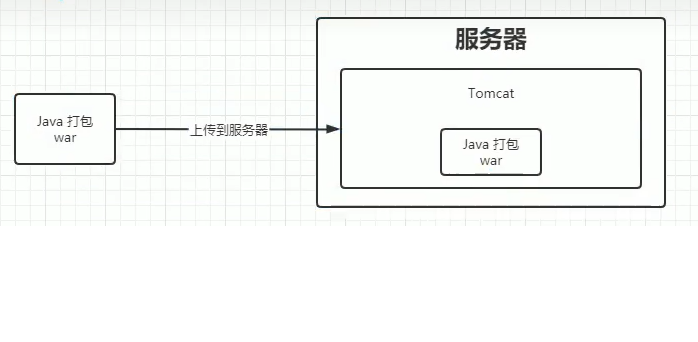
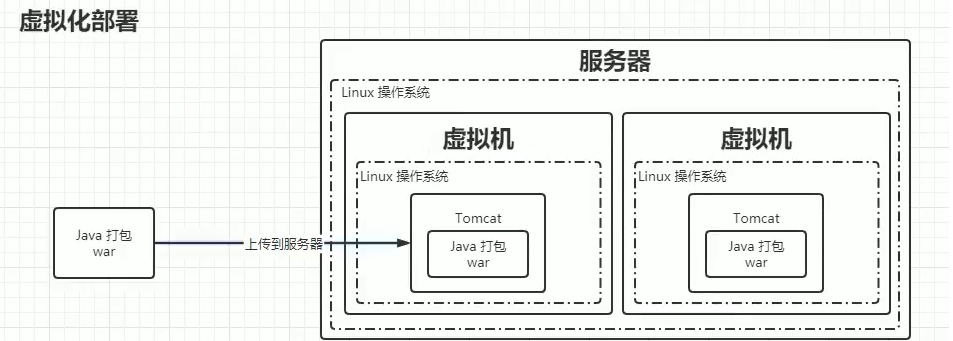
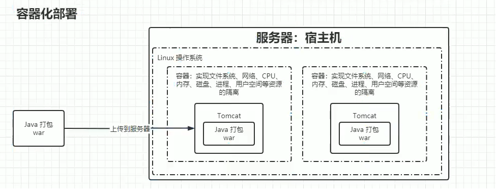

<!--
 * @Author: rooterShip
 * @Date: 2023-09-10 10:50:42
 * @LastEditors: rooterShip
 * @LastEditTime: 2024-04-26 10:50:05
-->
- 容器
  - 容器是虚拟机技术的一种，旨在为运行的程序提供运行环境和依赖，个人理解：开一个容器就类似于新开了一台属于自己的服务器，可以随便乱造且不会影响宿主机。

  - 容器和虚拟机的区别：虚拟机上面覆盖了自己的操作系统，而容器和宿主共用同一个操作系统，所以容器相对于虚拟机而言，既可以提供独立的软件运行环境，占用内存也小，启停速度快，操作更简单，更轻量级。

- 镜像
  - 可以把镜像比作应用程序的安装包，镜像中包含应用程序运行状态所需的所有东西，包括代码，依赖，配置等等，镜像是静态的，镜像需要由容器来运行。
  - 容器里的镜像是可以层层叠加的，比如运行我们的应用程序，需要使用mysql数据库，需要python运行环境，那么容器里只要要有mysql镜像、python镜像、我们自己的应用程序镜像。镜像是静态的，像软件安装包一样，没有运行环境是不可以运行的，那么容器就提供了这样一个运行环境。
  - 容器利用镜像来构建一个运行时环境以此运行一个应用程序。
具体逻辑关系：搭建一个容器想要跑起来某个程序，但是跑这个程序需要一些配置环境，比如java，mysql等环境，这个时候就需要搭建有java和mysql的环境，在容器内搭建这些环境就需要下载java，mysql的安装包（可以看作是基础镜像），然后
(dockerfile)docker build->docker run. 
镜像类比成类，容器类别成实例。--镜像是模板，容器是进程，dockerfile只是文件，里面放着参数和指令，docker build才是根据真实的文件构建docker镜像，docker run才是生成容器实例即开启新的进程 
dockerfile需要从基础镜像构建，然后根据dockerfile文件构建新镜像（区别基础镜像），然后根据镜像创建容器。
基础镜像是构建你的 Docker 镜像的起点。它可以是一个非常轻量级的操作系统（如 Alpine Linux），也可以是包含了一些预安装软件的镜像（如 Python、Node.js 的官方镜像）。基础镜像本身也是一个完整的 Docker 镜像，可以单独使用。 
当你使用 Dockerfile 构建镜像时，Docker 会按照 Dockerfile 中的指令，从基础镜像开始，逐步构建出一个新的镜像。这个新的镜像包含了基础镜像以及 Dockerfile 中定义的所有修改和添加的内容。 
基础镜像是构建过程的起点，而通过 Dockerfile 构建的新镜像是基于这个基础镜像，加上了一系列定制化的修改和添加。简单来说，基础镜像是原材料，新构建的镜像是最终产品。 
基础镜像通常是不变的，一旦选择了某个版本的基础镜像，除非你明确地更新它，否则它将保持不变。而新构建的镜像则是可变的，每次根据 Dockerfile 进行构建时，都可能产生不同的结果，取决于你对 Dockerfile 所做的修改。 
基础镜像通常是比较通用的，设计来满足广泛的需求。而通过 Dockerfile 构建的新镜像则是高度定制化的，专门为特定的应用或服务设计。 

- 部署方式
  - 传统部署
    将java项目打包成war包直接上传到服务器，多个tomcat服务器环境不隔离
    
  - 虚拟化部署
    利用虚拟机，在服务器的操作系统内部新建一个或者多个虚拟机（可以理解为新机器，拥有自己的操作系统，然后在里面部署web服务器(tomcat)并上传war包。），占用资源过度。
    
  - 容器化部署
    利用容器技术，多个容器共用宿主操作系统，但是在容器内依然能实现资源隔绝（文件系统，网络，CPU，内存，磁盘，进程，用户空间等）
    
    容器化部署相比较与传统部署与虚拟化部署方式而言，容器的生命周期大大缩短，容器变得极易被销毁重建，相对应产生的问题是，容器里面隔绝的资源（网络，硬盘等）也会被相应的修改，增加了这些资源的不稳定性，这对于容器内部部署的应用是具有风险的，为此，kubernetes（k8s)技术--容器管理技术，可以进行解决。
- 负载均衡
  -  负载均衡是一项基本的网络服务，主要是为了解决公司业务的并发压力，增强网络处理能力，减轻单个设备的资源压力，提高整体服务性能。
    客户端的流量先到达负载均衡服务器，负载均衡服务器通过某种调度算法将流量分配到不同的应用程序服务器。同时，负载均衡服务器还将在应用程序服务器上执行定期运行状况检查。当发现故障节点时，它将动态从应用程序服务器群集中删除节点，以确保应用程序的高可用性。
- 服务发现
  >详细解析见https://zhuanlan.zhihu.com/p/32027014
  - 在传统的系统部署中，服务运行在一个固定的已知的IP和端口上，如果一个服务需要调用另外一个服务，可以通过地址直接调用，但是，在虚拟化或容器化的环境中，服务实例的启动和销毁很频繁，服务地址在动态变化，将请求发送到动态变化的服务实例上，至少需要以下两个步骤：
    - 服务注册--存储服务的主机和端口信息
    - 服务发现--允许其他用户发现服务注册阶段存储的信息
    >服务发现的主要优点是可以无需了解架构的部署拓扑环境，只通过服务的名字就能够使用服务，提供了一种服务发布与查找的协调机制。服务发现除了提供服务注册、目录和查找三大关键特性，还需要能够提供健康查询、多种查询、实时更新和高可用性等。
  - 服务发现方式
    - 客户端服务发现
      客户端通过<b>直接</b>查询服务注册中心，获取可用的服务的实际网络地址(IP和端口)。然后通过负载均衡算法来选择一个可用的服务实例，并将请求发送至该服务器。优点：架构简单，扩展灵活，<b>方便实现负载均衡功能</b>，缺点：强耦合，有一定开发成本。
    - 服务端服务发现
      客户端向负载均衡器发送请求。负载均衡器查询服务注册中心找到可用的服务，然后转发请求到该服务上。优点：服务的发现逻辑对客户端是透明的。缺点：需要额外部署和维护高可用的负载均衡器。